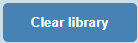

# TOP Project: Digital Library
    


## Introduction
([Back to Top](#my-digital-library))

### Table of Contents
  - [Introduction](#introduction)
    - [Table of Contents](#table-of-contents)
    - [Updates](#updates)
  - [About Project](#about-project)
    - [Screenshots](#screenshots)
      - [Desktop](#desktop)
      - [Mobile](#mobile)
    - [Original Project Instructions](#original-project-instructions)
    - [Technologies Used](#technologies-used)
- [How to Use](#how-to-use)
- [Links](#links)

### Updates
* **03/03/2022** - Added option to select (from a preselected list) a card's background color. Not only does this bring a little fun and variety to the page, but it also allows the users to then color according to categories, etc.
  
* **03/04/2022** - Successfully added localStorage capabilities, including buttons to save info to local storage as well as delete info from local storage. This was exciting because it was a breakthrough for me :D
  
* **03/27/2022** - I'm coming back from a break from this project that lasted a few weeks, but the break helped me clear my head enough to gedder'dun! I figured out all of the following today:
    * **Local Storage** - The one problem with Local Storage that I couldn't figure out last time was the ability to delete individual books and save it. Even if I was able to figure out how to delete a single book, I couldn't get then get to the part where the new list was saved correctly. A kind stranger on Stack Overflow assisted me to the correct solution.
    * Figured out how to save to local storage on any change, so "Save to Local Storage" button was deleted.
    * Added ability to click on "Read" label to toggle it between "Yes" and "No".
    * Added some design factors
        * Switched from flex to grid
        * Added white border around book boxes
        * Added "Instructions" box at the top, complete with "Hide/Show" capability.

## About Project 
([Back to Top](#top-project-digital-library))

This "library" is a project given by [The Odin Project](https:/www.theodinrpoject.org/)'s JavaScript course (found within both of the advanced paths after Foundations). It follows a lesson on [objects and object constructors](https://www.theodinproject.com/paths/full-stack-javascript/courses/javascript/lessons/objects-and-object-constructors), and their instructions are as follows:

### Screenshots

#### Desktop


#### Mobile


<br />

### Original Project Instructions
([Back to Top](#top-project-digital-library))

The following are the instructions for the project, taken from the project's page on The Odin Project's website.

1. If you haven’t already, set up your project with skeleton HTML/CSS and JS files.

2. All of your book objects are going to be stored in a simple array, so add a function to the script (not the constructor) that can take user’s input and store the new book objects into an array. Your code should look something like this:

    ```javascript
    let myLibrary = [];

    function Book() {
    // the constructor...
    }

    function addBookToLibrary() {
    // do stuff here
    }
    ```
3. Write a function that loops through the array and displays each book on the page. You can display them in some sort of table, or each on their own “card”. It might help for now to manually add a few books to your array so you can see the display.*

4. Add a “NEW BOOK” button that brings up a form allowing users to input the details for the new book: author, title, number of pages, whether it’s been read and anything else you might want.

5. Add a button on each book’s display to remove the book from the library.
   - You will need to associate your DOM elements with the actual book objects in some way. One easy solution is giving them a data-attribute that corresponds to the index of the library array.
6. Add a button on each book’s display to change its read status.
   - To facilitate this you will want to create the function that toggles a book’s read status on your Book prototype instance.
---
If you visit their page for that project, you can find plenty of finished examples of this project at the bottom.

<br />

### Technologies Used
([Back to Top](#top-project-digital-library))

During the creation of this project, I used the following languages, frameworks, and tools:

* HTML
* CSS
* JavaScript
* jQuery
* Visual Studio Code

<br>

## How to Use
([Back to Top](#top-project-digital-library))

1. Click on the "New Book" button to add a book to the library.

    

    Once you've added books to your library, they will be saved to your local storage automatically. If you wish to clear all of the books, you can click on the "Clear library" button.

    

2. Clicking this button brings up a popup window. Fill in the book's title, author, number of pages, and whether or not you've already read this book.

    

3. (**Optional**): You can select your card's background color via the dropdown menu at the bottom of the popup window. Do this for fun, to apply colors according to categories, etc. 

    

4. When done, click Submit. Please note that attempting to leave a field blank yields an error.

    

5. Once you click the Submit button, the popup window will close, and your book should now be displayed on the page in a card.

    

6. You can edit whether or not you've read the book by simply clicking on your "Read" status, which will then toggle your "Read" status.

    

7. You can also click the X in the upper right-hand corner to delete the book from your collection.

## Links
([Back to Top](#top-project-digital-library))

1. [Live Demo](https://risclover.github.io/TOP-Library)
2. [Code Repo](https://www.github.com/Risclover/TOP-Library) (You are here)
3. [Visit my developer portfolio!](https://risclover.github.io/)
